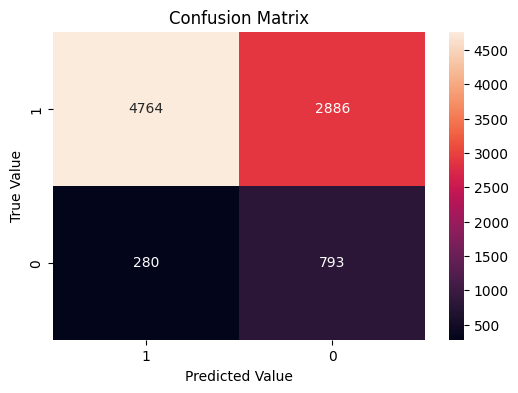

# Prediction of Bank Marketing Phone Campaign Success
Project of Advanced Machine Learning (AML) Course for the Master in Data Science Program of Universitat Politècnica de Catalunya (UPC)

## Overview of Project Implementation

This project is designed to apply various data modeling techniques to a real-world dataset. The chosen dataset is the [Portuguese Bank Marketing Dataset](https://archive.ics.uci.edu/dataset/222/bank+marketing) from the `UCI Repository`. The data is related to direct marketing campaigns of a Portuguese banking institution. `The marketing campaigns were based on phone calls`, and **the classification goal is to predict
if the client will subscribe (yes/no) a term deposit (target variable)
based on information about the client and the contact call**. The project covers all aspects of the modeling methodology, including exploratory data analysis, preprocessing, generating a final predictive model, and assessing its prediction quality. **A detailed description of the project's implementation and final results are included in the [Final Report](./docs/Report.pdf)**.

## Analysis Contents
1. Exploratory Data Analysis (EDA)
    * Univariate Exploratory Analysis
        * Univariate Outliers Analysis
    * Bivariate Exploratory Analysis
        * Multivariate Outlier Analysis
    * Feature Extraction
2. Experiments
    * Preprocessing
    * Dataset Splits
    * Learning Algorithms
    * Model Comparison & Hyper Parameter Tuning
    	* 5-fold Cross Validation on the following models, with multiple hyper-parameter values:
     		* Logistic Regression
       		* Random Forest
       		* SVM (with `linear`, `sigmoid`, `rbf` and `poly` kernels)
       		* Gradient Boosting
       		* kNN
       		* Decision Tree
       		* Naive Bayes
    * Final Model Performance Analysis (Generalization, bias, variance analysis)
        * Final model is an `SVM with signoid kernel`
        * Training-Test Error Analysis on the `C` Parameter
        * Training-Test Error Analysis on the `gamma` Parameter
        * Training-Test Error Analysis on the `class_weight` Parameter
        * Training-Test Error Analysis on the `Training Data Size`
        * Final Performance Metrics
        * Interpretability of the Final Model
3. Limitations & Future Work

## Instructions for Executing Analysis Notebooks

* Navigate to the `notebooks` folder included in the repository.
* Make sure `bank-full.csv` file is located under the `data` directory.
* Execute the notebooks with the following order:
	* [01.EDA-feature-extraction.ipynb](./notebooks/01.EDA-feature-extraction.ipynb)
		* This notebook generates in the end the updated dataset (named [bank_marketing_new.csv](./notebooks/bank_marketing_new.csv), under [notebooks](./notebooks/) directory), which includes all the changes introduced during **EDA**.
		* The new file ([bank_marketing_new.csv](./notebooks/bank_marketing_new.csv)) is being used from the second notebook in order to complete the modeling part.
	* [02.Experiments.ipynb](./notebooks/02.Experiments.ipynb)
    * [03.Modelling.ipynb](./notebooks/Modeling.ipynb)
        * In this notebook we have the main model executions, which we include in the results table of the report. It contains a data loading and several hyperparametrization executions on full and undersampled training set. 
* All notebooks generate some extra **csv** files, containing information used during the analysis
	* E.g.: [chi-2.csv](./notebooks/chi-2.csv), [accuracy_results.csv](./notebooks/accuracy_results.csv), and [recall_results.csv](./notebooks/recall_results.csv) files mentioned in the report are generated during the execution of the above-mentioned notebooks.
* Uncomment the first cell of the notebooks in order to install missing libraries.
* Click on the `Run all` button of the notebooks to reproduce the results of the whole project.

## Executed Notebooks
The following files, present the executed notebooks of the project.
* [01.EDA-feature-extraction.html](./notebooks/01.EDA-feature-extraction.html)
* [02.Experiments.html](./notebooks/02.Experiments.html)
* [03.Modelling.ipynb](./notebooks/Modeling.ipynb)

## Brief Analysis Results

- `Final Univariate Analysis`:

    

- `Final Bivariate Analysis`:

    

- `Best Hyperparameters for Each Model`:

    | Model               | Best Hyperparameters                                              |
    |---------------------|-------------------------------------------------------------------|
    | Logistic Regression | {’C’: 0.001, ’class weight’: ’balanced’, ’penalty’: ’l2’}         |
    | Random Forest       | {’class weight’: ’balanced’, ’max depth’: 10, ’n estimators’: 100}|
    | SVM linear          | {’C’: 0.001, ’class weight’: ’balanced’}                          |
    | SVM poly            | {’C’: 10, ’class weight’: ’balanced’, ’degree’: 2}                |
    | SVM rbf             | {’C’: 1, ’class weight’: ’balanced’, ’gamma’: ’scale’}            |
    | SVM sigmoid         | {’C’: 0.01, ’class weight’: ’balanced’, ’gamma’: ’scale’}         |
    | Gradient Boosting   | {’learning rate’: 0.1, ’n estimators’: 300}                       |
    | KNN                 | {’n neighbors’: 7, ’weights’: ’distance’}                         |
    | Naive Bayes         | {}                                                                |

- `Model Performance Metrics`:

    | Model               | Accuracy | Precision | Recall | F1-score | Valid. Error |
    |---------------------|----------|-----------|--------|----------|--------------|
    | Logistic Regression | 0.683    | 0.684     | 0.680  | 0.682    | 0.011        |
    | Random Forest       | 0.716    | 0.747     | 0.652  | 0.696    | 0.008        |
    | SVM linear          | 0.681    | 0.691     | 0.655  | 0.673    | 0.007        |
    | SVM poly            | 0.710    | 0.777     | 0.589  | 0.670    | 0.010        |
    | SVM rbf             | 0.712    | 0.771     | 0.603  | 0.677    | 0.010        |
    | SVM sigmoid         | 0.668    | 0.645     | **0.745**  | 0.692    | 0.009        |
    | Gradient Boosting   | 0.720    | 0.760     | 0.644  | 0.697    | 0.004        |
    | KNN                 | 0.673    | 0.687     | 0.634  | 0.660    | 0.005        |
    | Naive Bayes         | 0.636    | 0.761     | 0.397  | 0.522    | 0.007        |

    - The **Support Vector Machine (SVM) with a sigmoid kernel** was selected as the final model due to its `high recall value`, **which aligns with the primary goal of effectively identifying clients more likely to subscribe to the marketing offer**. The specific objectives of the model necessitate a strong emphasis on recall to ensure capturing as many positive outcomes as possible in future marketing campaigns. After evaluating various algorithms, it was determined that the `SVM with the sigmoid kernel`, optimized with the `hyperparameters` **C = 0.01, class weight = 'balanced', and gamma = 'scale'**, achieved the highest mean recall of **0.74**. This model was trained on an undersampled dataset, ensuring balanced class weights and enabling it to capture complex relationships within the data. Despite an overall accuracy of 0.63, the model's performance metrics, particularly its high recall for the positive class, make it the optimal choice for the specific use case. `By targeting a subset of potential clients identified by this model, it can efficiently capture **74%** of all feasible clients, optimizing a marketing strategy and resource utilization`.

        
